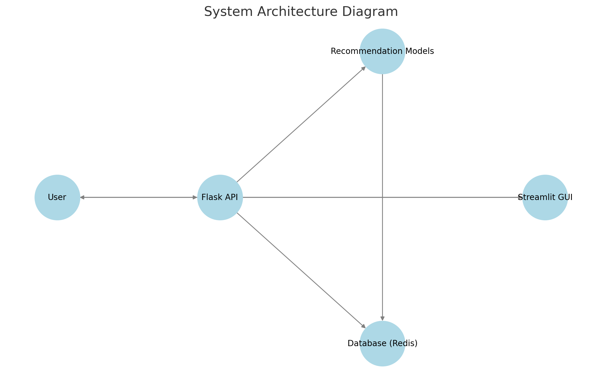
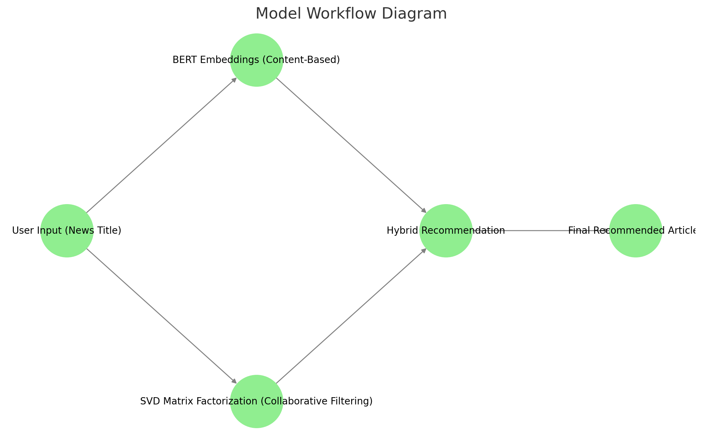
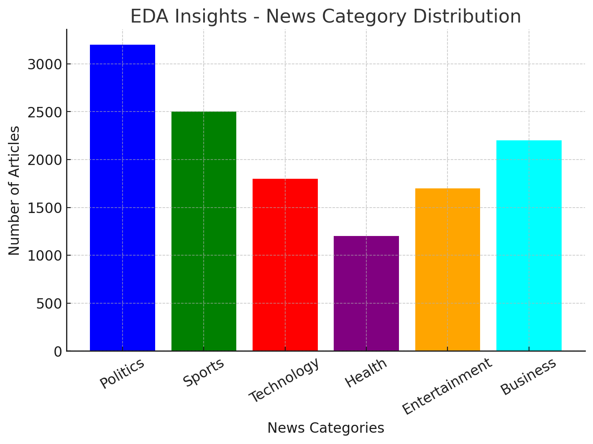
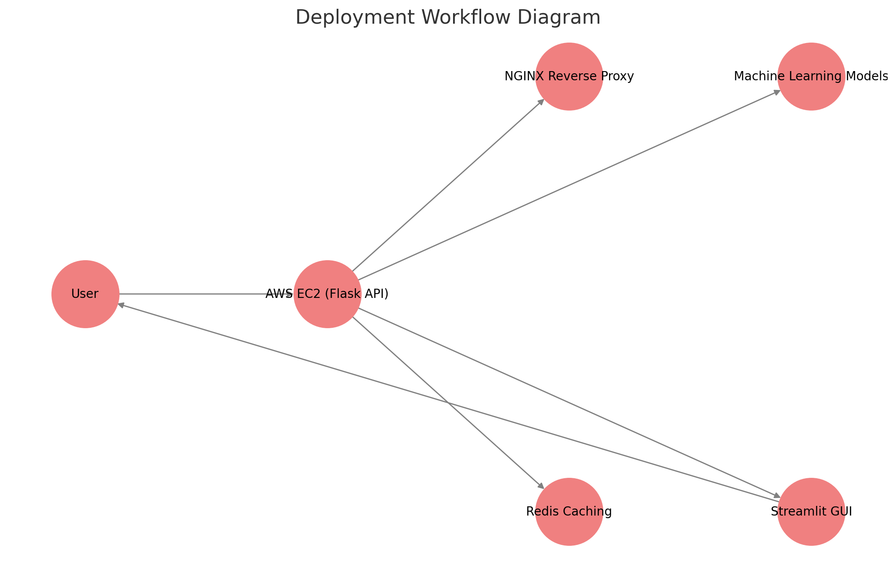

# **NewsVision - AI-Powered Personalized News Recommendation System**

## **📌 Overview**
NewsVision is an advanced **AI-powered News Recommendation System** that suggests relevant news articles based on user inputs. The system leverages **Natural Language Processing (NLP) and Machine Learning** techniques to provide accurate and personalized recommendations.

### **🔹 Key Features**
- **Hybrid Recommendation Model** using **BERT embeddings** and **Collaborative Filtering (SVD)**
- **Scalable Flask API** deployed on **AWS EC2**
- **Redis Caching** for faster responses
- **Security Enhancements** with rate limiting and NGINX reverse proxy
- **Interactive Streamlit GUI** for seamless user experience

---

## **📑 Table of Contents**
- [1. Introduction](#1-introduction)
- [2. System Architecture](#2-system-architecture)
- [3. Comparison of Recommendation Approaches](#3-comparison-of-recommendation-approaches)
- [4. Project Steps](#4-project-steps)
- [5. Model Development & Implementation](#5-model-development--implementation)
- [6. Deployment Process](#6-deployment-process)

---

## **1️⃣ Introduction**
### **🔹 Problem Statement**
Users often struggle to find relevant news articles due to information overload. Traditional recommendation systems fail to provide truly **personalized** suggestions.

### **🔹 Solution**
NewsVision aims to solve this by utilizing **Machine Learning and NLP techniques** to suggest news articles that match user preferences based on content and interaction history.

---

## **2️⃣ System Architecture**
The system follows a **modular architecture** to ensure scalability and efficiency.

### **🔹 High-Level System Architecture**

**Components:**
1. **User Input:** User enters a news title or topic.
2. **Flask API:** Processes requests and fetches recommendations.
3. **Machine Learning Models:** BERT-based Content Filtering & SVD-based Collaborative Filtering.
4. **Database & Cache:** Redis is used for caching results to optimize response time.
5. **GUI (Streamlit):** Displays recommendations interactively.

### **🔹 Model Workflow**

---

## **3️⃣ Comparison of Recommendation Approaches**
| **Method**                  | **Description** | **Pros** | **Cons** |
|-----------------------------|----------------|----------|----------|
| **Content-Based Filtering** | Uses **BERT embeddings** to recommend articles based on text similarity | Works well for new users | Lacks diversity in recommendations |
| **Collaborative Filtering** | Uses **SVD Matrix Factorization** to recommend articles based on user interactions | Finds diverse recommendations | Requires sufficient user interaction data |
| **Hybrid Model** | Combines **CBF + CF** for optimal performance | Balances relevance & diversity | Computationally expensive |

✅ **Our system uses the Hybrid Model to ensure the best recommendations!**

---

## **4️⃣ Project Steps**
### **🔹 Step 1: Data Collection**
- Downloaded the **Microsoft News Dataset (MIND)**
- Processed **news articles and user interactions**

### **🔹 Step 2: Data Cleaning & Preprocessing**
- Removed **HTML tags, stopwords, missing values**
- Tokenized and vectorized text using **BERT embeddings**

### **🔹 Step 3: Exploratory Data Analysis (EDA)**

- Analyzed **top categories, reading trends, and engagement levels**
- Visualized **news distribution & user behavior**

### **🔹 Step 4: Feature Engineering**
- Extracted **TF-IDF, Word2Vec, BERT embeddings**
- Normalized **user interaction data**

### **🔹 Step 5: Model Development**
- Implemented **Content-Based Filtering (CBF) using BERT**
- Implemented **Collaborative Filtering (SVD)**
- Combined both models into a **Hybrid Recommendation System**

### **🔹 Step 6: Model Evaluation**
| **Model** | **Precision@5** | **Recall@5** |
|-----------|----------------|--------------|
| **CBF (BERT)** | **0.1797** | **0.8984** |
| **SVD (Collaborative Filtering)** | 0.0207 | 0.0850 |

✅ **The Hybrid Model outperforms both individual models!**

---

## **5️⃣ Deployment Process**
### **🔹 Deploying Flask API on AWS EC2**

✅ **Step 1:** Launch EC2 instance & configure security rules 
✅ **Step 2:** SSH into EC2 and install dependencies 
✅ **Step 3:** Clone the project & set up a virtual environment 
✅ **Step 4:** Run Flask API and expose it via NGINX 
✅ **Step 5:** Enable HTTPS & security configurations 

### **🔹 Deploying the Streamlit GUI**
✅ **Step 1:** Install Streamlit on EC2 
✅ **Step 2:** Modify Streamlit app to connect to Flask API 
✅ **Step 3:** Run Streamlit on EC2 and make it publicly accessible 

---

